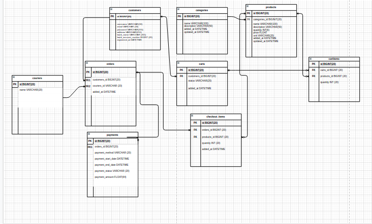

# Alta Store REST API (ASRA)

## Overview

ASRA is REST-API specifically build to support online store system of ALTA. ASRA provides functionality that allows developers to behave either as customer or admin. ASRA is created using Golang, Gorm, and MYSQL as database.

The MVP of ASRA is :

* Login and register customers
* Customers can view list product based on product category
* Customers can add product to shopping cart
* Customers can see a list of products that have been added to the shopping cart
* Customers can delete the product list from the shopping cart
* Customers can checkout and make payment transactions

And this ERD of ASRA is like this :

## Tutorial

We provide another documentation using swagger to make it easy to understand the basic of API.

How to run this project :

1. git clone `https://github.com/jokosu10/project-alta-store.git`
2. cd `project-alta-store` and run `go install`
3. setup envirotment, rename file `.env.example` to `.env`. And setup this variabel envirotment.
4. after finished install this module, run command `go run swagger.go` for running this documentation to browser like this `localhost:8080/swaggerui`
5. run command `go run main.go` to running this server like this `localhost:8000`
6. run command `go test ./controller/ -cover` for running unit testing

## HTTP requests

There are 4 basic HTTP requests that you can use in this API:

* `POST` Create a resource
* `PUT` Update a resource
* `GET` Get a resource or list of resources
* `DELETE` Delete a resource

## HTTP Responses

Each response will include a code(repsonse code),message,status and data object that can be single object or array depending on the query.

## HTTP Response Codes

Each response will be returned with one of the following HTTP status codes:

* `200` `OK` The request was successful
* `400` `Bad Request` There was a problem with the request (security, malformed, data validation, etc.)
* `404` `Not found` An attempt was made to access a resource that does not exist in the API
* `500` `Server Error` An error on the server occurred